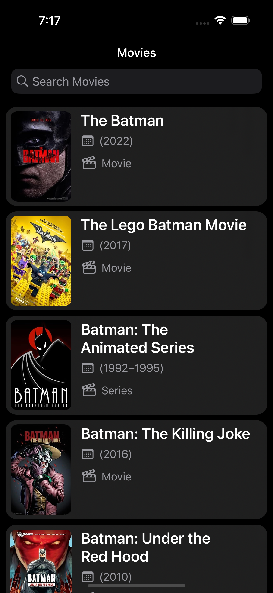
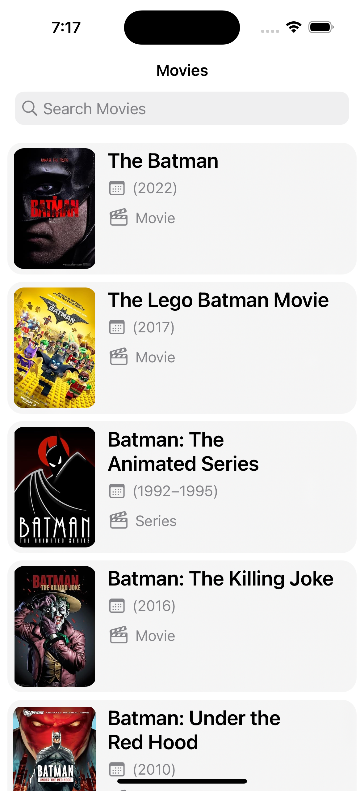
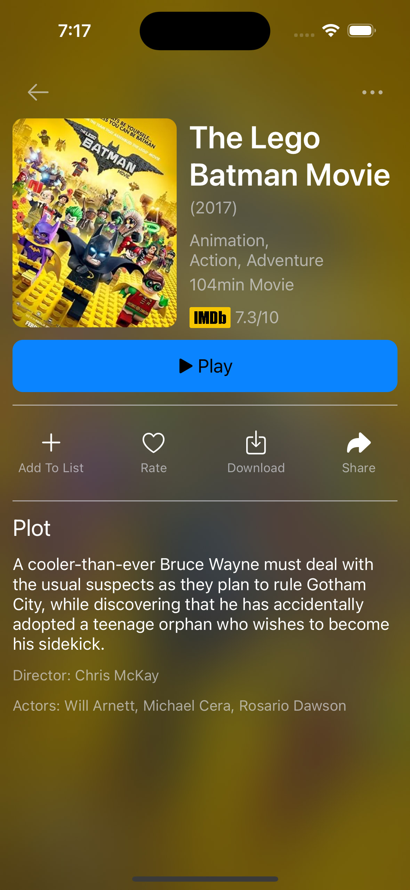
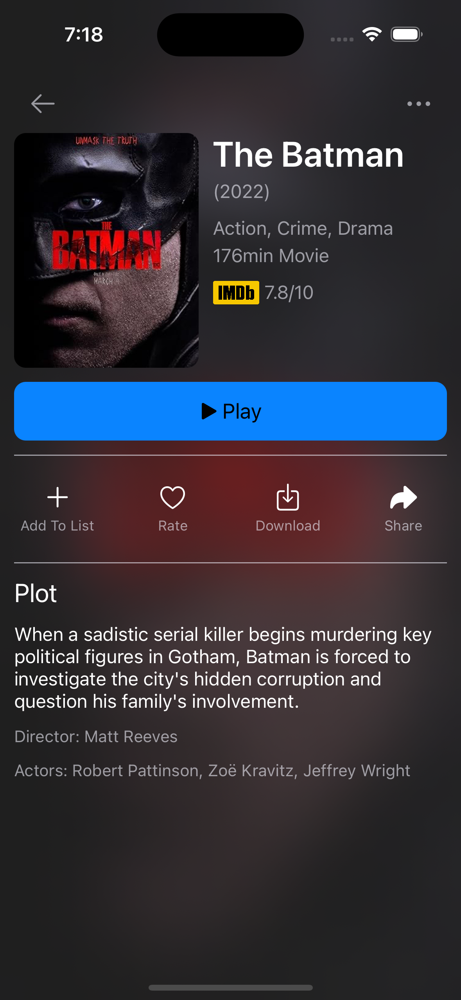
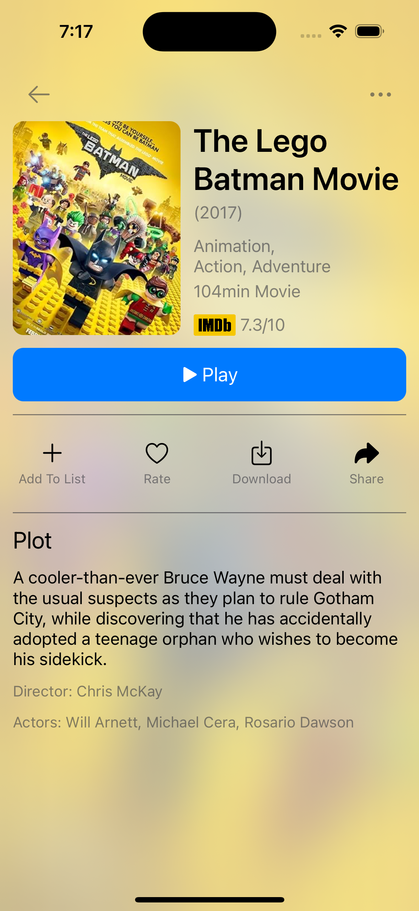

#  MoviesApp

Protocol Oriented Movie App for Pazarama iOS Bootcamp

## Screenshots
<table>
  <tr>
    <th>Main Screen - Dark</th>
    <th>Main Screen - Light</th>
    <th>Error Page</th>
  </tr>
  <tr>
    <td></td>
    <td></td>
    <td></td>
  </tr>
  <tr>
    <th>Detail Screen - Dark</th>
    <th>Detail Screen - Dark</th>
    <th>Detail Screen - Light</th>
  </tr>
  <tr>
    <td></td>
    <td></td>
    <td></td>
  </tr>
 </table>

## Tech

- Programmatic UI
- Protocol Oritented and Delegate Pattern
- Unit and UI Test
- UrlSession
- MVVM
- KingFisher

## Api

**[OMDB](https://www.omdbapi.com/)**.
